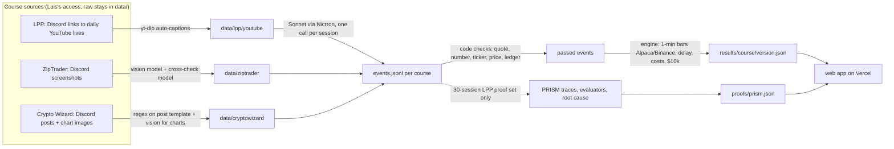
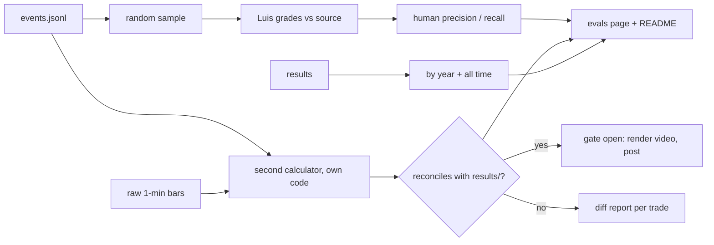

# Architecture diagrams

## Data flow today (what the README must show, CAP-6)

```mermaid
flowchart LR
  subgraph Sources["Course sources (Luis's access, raw stays in data/)"]
    D1[LPP: Discord links to daily YouTube lives]
    D2[ZipTrader: Discord screenshots]
    D3[Crypto Wizard: Discord posts + chart images]
  end
  D1 -->|yt-dlp auto-captions| C1[data/lpp/youtube]
  D2 -->|vision model + cross-check model| C2[data/ziptrader]
  D3 -->|regex on post template + vision for charts| C3[data/cryptowizard]
  C1 -->|Sonnet via Nicrron, one call per session| E[events.jsonl per course]
  C2 --> E
  C3 --> E
  E -->|code checks: quote, number, ticker, price, ledger| P[passed events]
  P -->|engine: 1-min bars Alpaca/Binance, delay, costs, $10k| R[results/course/version.json]
  R --> W[web app on Vercel]
  E -.->|30-session LPP proof set only| PR[PRISM traces, evaluators, root cause]
  PR --> PF[proofs/prism.json] --> W
```

## Audit additions (CAP-1..5)

```mermaid
flowchart LR
  E[events.jsonl] --> S[random sample] --> G[Luis grades vs source] --> H[human precision / recall]
  E --> X[second calculator, own code] --> RC{reconciles with results/?}
  B[raw 1-min bars] --> X
  RC -->|yes| OK[gate open: render video, post]
  RC -->|no| BUG[diff report per trade]
  R[results] --> Y[by year + all time]
  H --> V[evals page + README]
  RC --> V
  Y --> V
```
